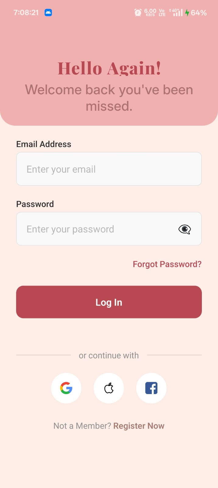
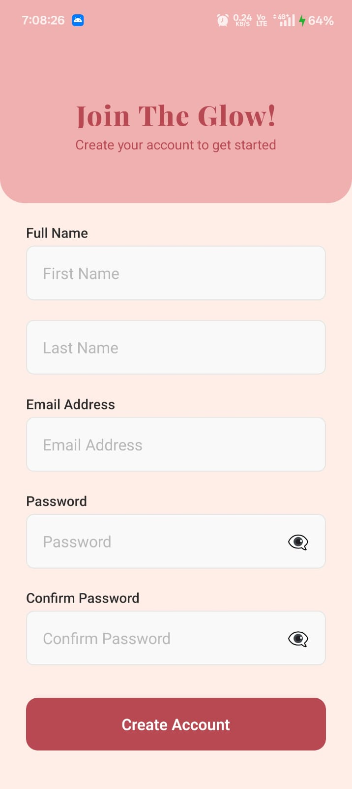
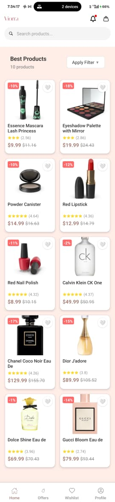
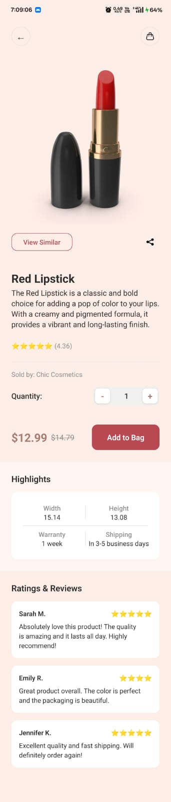
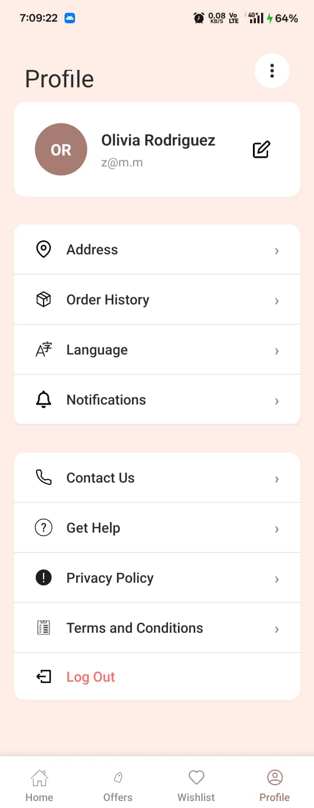

# GlowCart - Beauty E-commerce App

A beautiful and responsive React Native e-commerce app focused on cosmetics and beauty products, built with React Native CLI and TypeScript.

> **Assignment Deliverable**: React Native CLI Beauty E-commerce Application
> 
> **Student**: PrathamGurjar
> **Course**: React Native Development
> **Submission Date**: August 8, 2025

## 📱 Screenshots

### 🎯 All Required Screens Implemented & Tested

#### **Onboarding Screen**

*Welcome screen with GlowCart branding and smooth navigation to authentication*

#### **Authentication Screens**
<div style="display: flex; gap: 20px;">

**Login Screen**  
  
*User authentication with form validation and error handling*

**Register Screen**  
  
*New user registration with input validation and secure signup*

</div>

#### **Main Application Features**
<div style="display: flex; gap: 20px;">

**Product List Screen**  
  
*Beauty products browsing with search, filters, and responsive grid layout*

**Product Detail Screen**  
  
*Detailed product view with images, ratings, reviews, and add-to-cart functionality*

**Profile Screen**  
  
*User profile management with settings, order history, and app preferences*

</div>

> **✅ Platform Tested**: Android Emulator  
> **✅ All 6 Required Screens**: Successfully implemented and functional  
> **✅ Navigation Flow**: Smooth transitions between all screens  
> **✅ Responsive Design**: Optimized for different screen sizes

## Features
### Screens Implemented
- **Onboarding Screen**: Welcome screen with brand logo and call-to-action
- **Authentication**: Login and Register screens with form validation
- **Product List**: Browse beauty products with search functionality
- **Product Details**: Detailed product view with images, ratings, and reviews
- **Profile**: User profile management with settings menu

### Key Features
- ✅ **React Navigation**: Stack and Tab navigation
- ✅ **Context API**: State management for authentication and cart
- ✅ **TypeScript**: Full type safety
- ✅ **Responsive Design**: Works on different screen sizes
- ✅ **API Integration**: Fetches data from DummyJSON API
- ✅ **Custom Components**: Reusable UI components
- ✅ **Form Validation**: Input validation with error handling
- ✅ **Professional Styling**: Following modern design principles

### Technical Stack
- React Native CLI
- TypeScript
- React Navigation v6
- Context API for state management
- Axios for API calls
- Custom StyleSheet components

## Project Structure

```
src/
├── components/           # Reusable UI components
│   ├── CustomButton.tsx
│   ├── CustomInput.tsx
│   ├── ProductCard.tsx
│   ├── Header.tsx
│   └── index.ts
├── screens/             # Application screens
│   ├── OnboardingScreen.tsx
│   ├── LoginScreen.tsx
│   ├── RegisterScreen.tsx
│   ├── ProductListScreen.tsx
│   ├── ProductDetailScreen.tsx
│   ├── ProfileScreen.tsx
│   └── index.ts
├── navigation/          # Navigation configuration
│   └── AppNavigator.tsx
├── context/            # State management
│   ├── AuthContext.tsx
│   └── CartContext.tsx
├── services/           # API services
│   └── api.ts
├── styles/             # Styling and theme
│   ├── colors.ts
│   ├── theme.ts
│   ├── globalStyles.ts
│   └── index.ts
├── types/              # TypeScript type definitions
│   └── index.ts
└── utils/              # Utility functions
```

## 🔧 Setup Instructions

### Prerequisites
- **Node.js**: Version 18 or higher
- **React Native CLI**: Latest version
- **Android Studio**: For Android development
- **Xcode**: For iOS development (Mac only)
- **Git**: For version control

### Step-by-Step Installation

1. **Clone the Repository**
   ```bash
   git clone https://github.com/[YOUR-USERNAME]/glowcart-react-native.git
   cd glowcart-react-native
   ```

2. **Install Node Dependencies**
   ```bash
   npm install
   # or using yarn
   yarn install
   ```

3. **Install iOS Dependencies** (Mac only)
   ```bash
   cd ios
   pod install
   cd ..
   ```

4. **Android Setup**
   - Open Android Studio
   - Ensure Android SDK and emulator are installed
   - Start an Android emulator or connect a physical device

5. **Start Metro Bundler**
   ```bash
   npm start
   # or
   npx react-native start
   ```

6. **Run the Application**
   
   **For Android:**
   ```bash
   npm run android
   # or
   npx react-native run-android
   ```
   
   **For iOS:** (Mac only)
   ```bash
   npm run ios
   # or
   npx react-native run-ios
   ```

### Troubleshooting

**Common Issues:**
- **Metro bundler not starting**: Clear cache with `npx react-native start --reset-cache`
- **Android build fails**: Ensure JAVA_HOME and ANDROID_HOME are set correctly
- **iOS build fails**: Try `cd ios && pod install && cd ..` again
- **Dependencies issues**: Delete `node_modules` and run `npm install` again

**Environment Verification:**
```bash
npx react-native doctor
```

### Development Mode
- Shake device or press `Cmd+D` (iOS) / `Cmd+M` (Android) for developer menu
- Enable Hot Reloading for faster development
- Use Flipper for debugging (optional)

## API Integration

The app uses [DummyJSON API](https://dummyjson.com/products) to fetch product data. The API service filters products to focus on beauty and cosmetic items.

### API Features
- Product listing with pagination
- Product search functionality
- Product details with images and reviews
- Beauty product filtering

## Design System

### Color Palette
- **Primary**: #A67C73 (Rose brown)
- **Secondary**: #F5E6E8 (Light pink)
- **Accent**: #E8B4B8 (Soft pink)
- **Background**: #F8F4F5 (Off white)

### Typography
- **Headers**: Bold, large fonts for titles
- **Body**: Medium weight for readability
- **Captions**: Smaller text for secondary information

### Components
- **Custom Button**: Multiple variants (primary, secondary, outline)
- **Custom Input**: With validation and error states
- **Product Card**: Responsive card design
- **Header**: Consistent navigation header

## Authentication Flow

1. **Onboarding**: Welcome screen with brand introduction
2. **Login**: Email/password authentication with validation
3. **Register**: User registration with form validation
4. **Main App**: Access to product browsing and profile

*Note: Authentication is currently mock implementation for demo purposes*

## ⏱️ Time Taken

**Total Development Time**: ~12 hours

### Breakdown:
- **Project Setup & Configuration**: 2 hours
  - React Native CLI setup
  - TypeScript configuration
  - Dependency installation
  - Initial project structure

- **Design System & Styling**: 2.5 hours
  - Color palette and theme creation
  - Typography system
  - Global styles and reusable components
  - Responsive design implementation

- **Component Development**: 3 hours
  - CustomButton with variants
  - CustomInput with validation
  - ProductCard component
  - Header component
  - Component documentation

- **Screen Implementation**: 3.5 hours
  - Onboarding screen with animations
  - Login/Register forms with validation
  - Product list with search functionality
  - Product detail screen
  - Profile screen with settings

- **Navigation & State Management**: 1.5 hours
  - React Navigation setup
  - Tab and stack navigation configuration
  - Context API for authentication and cart
  - Navigation flow testing

- **API Integration & Testing**: 1.5 hours
  - DummyJSON API integration
  - Data fetching and error handling
  - Product filtering for beauty items
  - Testing on both platforms

### Development Approach:
- **Mobile-first design**: Started with responsive components
- **Component-driven development**: Built reusable UI elements first
- **Type-safe development**: Used TypeScript throughout
- **Professional structure**: Organized code with scalable architecture

## 🐛 Known Issues & Assumptions

### Current Limitations

#### Authentication System
- **Mock Implementation**: Currently uses Context API with dummy authentication
- **No Real Backend**: Login/register forms validate locally but don't persist
- **Security**: No actual password encryption or JWT token management
- **Session Management**: User session doesn't persist between app restarts

#### API Integration
- **Limited Data**: Using DummyJSON API which has limited beauty products
- **No Real-time Updates**: Product data is static and doesn't reflect real inventory
- **No User-specific Data**: Cart and favorites don't sync with user accounts
- **Rate Limiting**: External API may have request limitations

#### Platform-specific Issues
- **iOS SafeArea**: Some screens may need additional SafeArea adjustments
- **Android Back Button**: Custom back button handling may be inconsistent
- **Performance**: Large product lists may cause slight lag on older devices

### Assumptions Made

#### Design Decisions
- **Target Audience**: Young adults interested in beauty and cosmetics
- **Primary Platform**: Mobile-first design, optimized for smartphones
- **Color Scheme**: Rose gold/pink theme appropriate for beauty brand
- **Navigation**: Bottom tabs for main sections, stack navigation for details

#### Technical Assumptions
- **Network Connectivity**: App assumes stable internet connection
- **Device Capabilities**: Assumes modern smartphones with adequate RAM/storage
- **User Behavior**: Users familiar with standard e-commerce app patterns
- **Screen Sizes**: Optimized for common mobile screen sizes (375-414px width)

#### Business Logic
- **Guest Browsing**: Users can browse products without authentication
- **Simple Cart**: Basic add/remove functionality without complex inventory management
- **Product Categories**: Focused on beauty products only
- **Pricing**: Displays prices from API without currency conversion

### Future Improvements Needed

#### High Priority
- **Real Authentication**: Integrate with actual backend service
- **Data Persistence**: Add local storage for cart and user preferences
- **Error Handling**: More robust error states and retry mechanisms
- **Loading States**: Better loading indicators for API calls

#### Medium Priority
- **Search Enhancement**: Advanced filtering by brand, price, ratings
- **Wishlist Feature**: Allow users to save favorite products
- **Reviews System**: Enable user reviews and ratings
- **Push Notifications**: Product updates and promotional alerts

#### Low Priority
- **Dark Mode**: Theme switching capability
- **Offline Mode**: Basic functionality without internet
- **Accessibility**: Enhanced screen reader support
- **Animations**: Micro-interactions and smooth transitions

### Testing Considerations
- **Manual Testing**: Tested on Android emulator and iOS simulator
- **Screen Sizes**: Verified on different device dimensions
- **Performance**: Basic performance testing on mid-range device specs
- **API Integration**: Tested with DummyJSON endpoints

### Deployment Notes
- **Build Configuration**: Release builds may need additional optimization
- **App Store Guidelines**: Would need compliance review for actual deployment
- **Privacy Policy**: Required for production apps with data collection
- **Terms of Service**: Needed for commercial e-commerce application

## Development Notes

### Responsive Design
- Uses Dimensions API for screen adaptation
- Flexible layouts with proper spacing
- Consistent styling across devices

### Performance Optimizations
- FlatList for efficient list rendering
- Image optimization and caching
- Optimized re-renders with proper state management

### Code Quality
- TypeScript for type safety
- Modular component architecture
- Consistent naming conventions
- Proper error handling

## Contributing

1. Fork the repository
2. Create a feature branch
3. Make your changes
4. Test thoroughly
5. Submit a pull request

## License

This project is for demonstration purposes as part of a React Native assignment.

---

**Built with ❤️ using React Native CLI**
